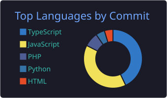
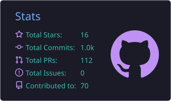

 

---

## About

Systems Engineer working as **Senior Development Lead**, leading the delivery of web platforms, internal tooling and automation systems end to end — from architecture and data modeling through deployment, monitoring and technical SEO.

- **Building** — an AI-assisted website builder and a custom CRM for agency operations
- **Automating** — business workflows with n8n, GoHighLevel and API integrations
- **Optimizing** — Core Web Vitals, crawlability and structured data on production sites
- **Leading** — development standards, code review and technical decisions across projects
- **Based in** — `America/Managua · UTC−6`, available for remote collaboration

---

## Tech Stack

|  |  |
|:--|:--|
| **Languages** |  |
| **Frontend** |  |
| **Backend** |  |
| **DevOps** |  |
| **CMS & E-commerce** |     |
| **Automation** |    |

---

## GitHub Analytics

> Every card above is rendered **inside this repository** by scheduled GitHub Actions and committed as a static SVG. Nothing depends on the public `github-readme-stats` instance, which is rate-limited and has had repeated outages.

<b>How these stats are generated</b>

 

| Workflow | Action | Output | Schedule |
|---|---|---|---|
| `profile-summary-cards.yml` | [`vn7n24fzkq/github-profile-summary-cards`](https://github.com/vn7n24fzkq/github-profile-summary-cards) | `profile-summary-card-output/` | Daily 03:00 UTC |
| `metrics.yml` | [`lowlighter/metrics`](https://github.com/lowlighter/metrics) | `assets/*.svg` | Daily 04:00 UTC |
| `snake.yml` | [`Platane/snk`](https://github.com/Platane/snk) | `output` branch | Every 12h |

All three commit their own artifacts back to the repository, so the README renders from local files instead of third-party endpoints.

---

## Contribution Graph

<picture>
  <source media="(prefers-color-scheme: dark)" srcset="https://raw.githubusercontent.com/MaycollJaramillo01/MaycollJaramillo01/output/github-snake-dark.svg" />
  <source media="(prefers-color-scheme: light)" srcset="https://raw.githubusercontent.com/MaycollJaramillo01/MaycollJaramillo01/output/github-snake.svg" />
  
</picture>

---

## Featured Repositories

| Project | What it does | Stack | Repository |
|---|---|---|---|
| **Cluster Web Builder** | AI-assisted website builder that generates production-ready sites from structured briefs | `Next.js` `Node` `AI` |  |
| **Cluster CRM** | CRM and internal operations platform: pipelines, clients and reporting | `React` `Node` `PostgreSQL` |  |
| **Better SEO** | Technical SEO tooling — audits, crawl checks and on-page diagnostics | `TypeScript` `Node` |  |
| **ScraperPro** | Web scraping and data automation pipelines for lead and market data | `Python` `Automation` |  |
| **POS Spring Boot** | Point-of-sale platform with inventory and transaction management | `Java` `Spring Boot` `MySQL` |  |
| **Components Web** | Reusable, accessible web component library for client projects | `HTML` `CSS` `JS` |  |

---

## Certifications

---

### Let's build something

Open to technical leadership roles, platform architecture and automation projects.

