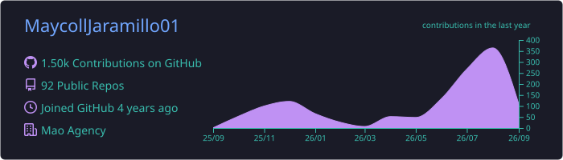
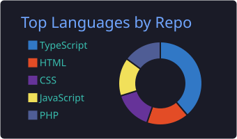
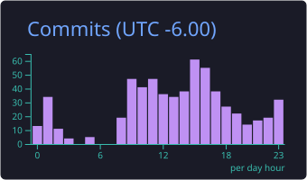

 

 

**Senior Development Lead** at [Cluster.marketing LLC](https://cluster.marketing/) and **Lead Web Developer** at Maven. Systems Engineer leading web platforms, internal tooling and automation systems end to end — architecture, delivery, deployment and technical SEO.

Currently building an AI-assisted website builder and a custom CRM for agency operations. Based in `America/Managua · UTC−6`, working remotely.

 

## Stack

 

 

<b>Frontend & UI</b>

 

 

<b>Backend & APIs</b>

 

 

<b>Databases & Data</b>

 

 

<b>DevOps, Hosting & Development Tools</b>

 

 

<b>Automation, AI & CRM</b>

 

 

 

<b>Technical SEO, Analytics & Accessibility</b>

 

 

<b>CMS, Commerce & Digital Experience</b>

 

 

<b>Testing, Scraping & Code Quality</b>

 

 

<b>Design & Documentation</b>

 

 

 

## Activity

 

## Selected Work

| Project | Description | Stack |
|:--|:--|:--|
| [**Cluster Web Builder**](https://github.com/MaycollJaramillo01/Cluster-web-Builder) | AI-assisted website builder that turns structured briefs into production-ready sites | Next.js · Node |
| [**Cluster CRM**](https://github.com/MaycollJaramillo01/ClusterCRM) | CRM and internal operations platform: pipelines, clients, reporting | React · Node · PostgreSQL |
| [**Better SEO**](https://github.com/MaycollJaramillo01/Better-SEO) | Technical SEO tooling — audits, crawl checks, on-page diagnostics | TypeScript · Node |
| [**ScraperPro**](https://github.com/MaycollJaramillo01/ScraperPro) | Web scraping and data automation pipelines | Python |
| [**POS Spring Boot**](https://github.com/MaycollJaramillo01/pos-springboot) | Point-of-sale platform with inventory and transactions | Java · Spring Boot |
| [**Components Web**](https://github.com/MaycollJaramillo01/Components-Web) | Reusable, accessible web component library | HTML · CSS · JS |

 

## Certifications

 

---

Open to technical leadership roles, platform architecture and automation projects.

